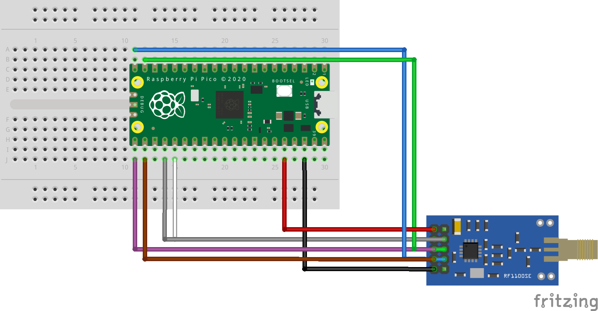

# Decoding 433MHz Doorbell codes

The goal is to receive and decode the signal from a wireless doorbell. The
doorbell sends on the 433MHz band with a frequency of 433.92MHz. The signal is
a Princeton 24bit encoding (PTxxxx chips).

## Wiring

